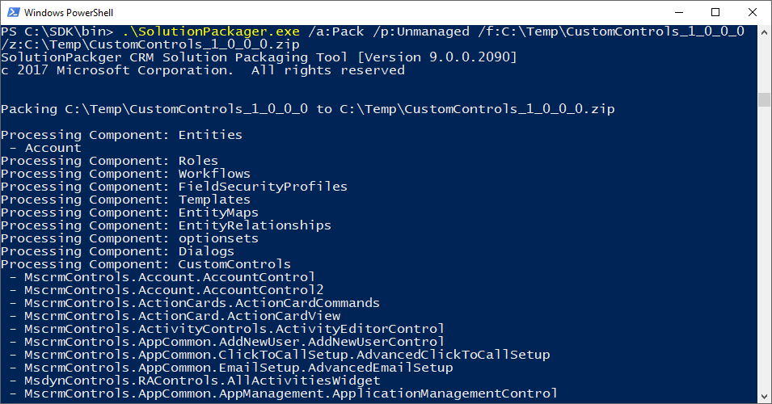

# Solution Packager - Plugins

## Overview
It is possible to extend the _SolutionPackager_ utility for Dynamics 365 with plugins.  This project will contain plugins I've developed.

### Plugins

| Name           | Description  |
|:---------------|:-------------|
| CustomControls | Adds suport for extracting/packing solutions which contain Custom Controls.

## Usage
Run `SolutionPackager.exe` directly from the build directory, or copy the `SolutionPackager.Plugins.dll` to your SDK directory.

For example, the CustomControls plugin allows the packager to process CustomControl components.  
